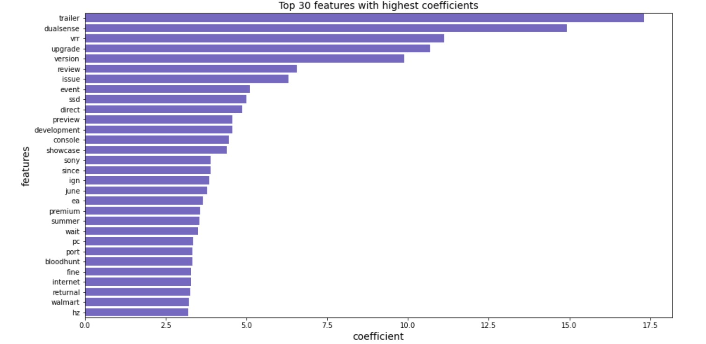

# Project 3: Web APIs & NLP

## Contents:
- [Problem Statement](#problem-Statement)
- [Data Dictionary](#Data-Dictionary)
- [Executive Summary](#Executive-Summary)

## Problem Statement

The PlayStation 5 (PS5) is the latest next-generation video gaming console from Sony Interactive Entertainment (Sony) and was released in Nov 2020. However, being almost 2 years after its release, demand for the PS5 is still strong, as global chip shortage due to the pandemic has affected Sony's production for the console. As a result, gamers are going back to its predecessor, the PlayStation 4 (PS4), for its extensive range of game titles and [continued support](https://pledgetimes.com/playstation-4-sonys-support-will-last-another-3-years/) by Sony, despite being released since Nov 2013.

For gamers that are deciding to purchase the PS4 or PS5, they can check out [r/PS5](https://www.reddit.com/r/PS5/) and [r/PS4](https://www.reddit.com/r/PS5/) on Reddit for discussions on these gaming consoles or create their new posts. To help new users decide which subreddit is more suitable to post on, we will be building a classifier using [Pushshift's](https://github.com/pushshift/api) API. Posts will be collected from r/PS5 and r/PS4, and classification models will be trained by learning which subreddit a given post came from.

We will be using a mixture of Logistic Regression, Naive Bayes, Decision Tree and Random Forest models and evaluate the best performing model with the highest accuracy score.

## Data Dictionary

This data dictionary serves to explain the list of columns headers used in datasets.

|   | Feature             | File Location                  | Type   | Description                                    |
|---|---------------------|--------------------------------|--------|------------------------------------------------|
| 1 | subreddit           | ps4, ps5, ps4_clean, ps5_clean | object | Subreddit of post taken from, i.e. PS4 and PS5 |
| 2 | id                  | ps4, ps5, ps4_clean, ps5_clean | object | Identifier of post                             |
| 3 | title               | ps4, ps5, ps4_clean, ps5_clean | object | Title of post                                  |
| 4 | selftext            | ps4, ps5, ps4_clean, ps5_clean | object | Additional description within post             |
| 5 | removed_by_category | ps4, ps5                       | object | Category for post removed from subreddit       |
| 6 | created_utc         | ps4, ps5                       | int    | Post creation time in Unix epoch format        |
| 7 | post                | combined                       | object | Combination of `post` and `title`              |

## Executive Summary

Results from the classification models are shown below. The best performing model is using a combination of TF-IDF Vectorizer and Logistic Regression, obtaining the highest cross-validation and f1 score among all the models.

| Classification Model                       | Train Score | Test Score | Cross Val Score | F1 Score |
|--------------------------------------------|-------------|------------|-----------------|----------|
| 1. CountVectorizer + Multinomial NB        | 0.79849     | 0.73531    | 0.74214         | 0.82652  |
| 2. TF-IDF Vectorizer + Multinomial NB      | 0.79223     | 0.74093    | 0.74840         | 0.83910  |
| 3. CountVectorizer + Logistic Regression   | 0.83453     | 0.74604    | 0.75019         | 0.83710  |
| **4. TF-IDF Vectorizer + Logistic Regression** | **0.81919**     | **0.75013**    | **0.75300**         | **0.84077**  |
| 5. CountVectorizer + Decision Tree         | 0.78469     | 0.72305    | 0.72451         | 0.82750  |
| 6. TF IDF Vectorizer + Decision Tree       | 0.78776     | 0.71794    | 0.72170         | 0.82432  |
| 7. CountVectorizer + Random Forest         | 0.93087     | 0.73020    | 0.73869         | 0.83088  |
| 8. TF IDF Vectorizer + Random Forest       | 0.96179     | 0.73684    | 0.74240         | 0.83252  |

From the list of top 30 words generated, 'trailer' has obtained the highest coefficient, which is likely referring to discussions of upcoming games to be released. Other words such as 'upgrade', 'preview' and 'development' also contribute to the list of features for r/PS5, reflecting the ongoing changes and development for the console. There are technical terms such as the DualSense wireless controller and Variable Refresh Rate (VRR) specific to PS5 listed here. Lastly, game titles exclusive to the PS5 such as 'Bloodhunt' and 'Returnal' are included as well.
